# Building Realtime Maps

## Java 8 JDK 설치하기
- **https://www.oracle.com/java/technologies/javase-jdk8-downloads.html**
- 위의 링크에 접속하요 본인의 환경에 맞는 JDK (Java Development Kit)을 우선 설치      
(본인은 Window 환경)   
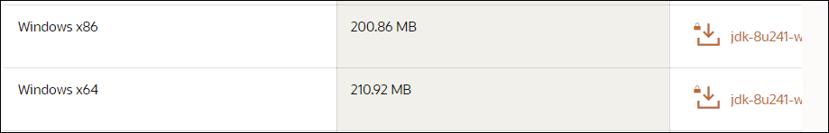
- Prompt창에서 JAVA가 잘 설치되었는지 아래 명령어 입력후 확인
    ```linux
    java -version
    ```
    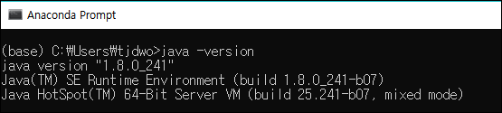
    - 버전등의 설명이 잘 나옴

--- 

## 환경변수 path 추가해주기
- JDK를 설치후 설치한 내용을 환경변수에 추가해주어야 함
- window키를 누르고 '시스템 환경 변수 편집' 을 입력하면 나오는것을 클릭   
- '시스템 속성' 에서 '환경 변수' 클릭   
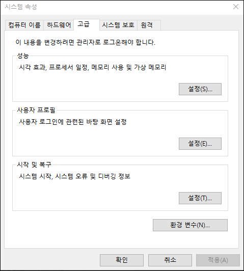
- '시스템 변수' 부분에서 '새로 만들기' 클릭   
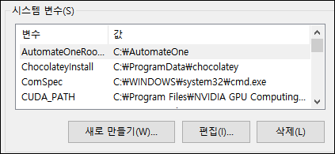
- '새 시스템 변수'에서 '디렉터리 찾아보기' 클릭   
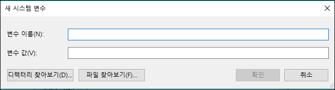
- 본인이 설치한 JDK의 설치경로(폴더) 선택하기 (보통 program files/java/ 의 경로에 설치됨)   
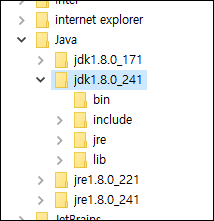
- 변수 이름을 입력후 확인 누르기 (이름은 임의로 JAVA_HOME 이라고 설정함)   
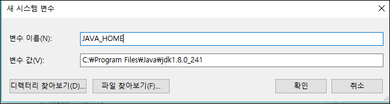
- 시스템 변수에 추가해준 뒤 '사용자 변수'의 'path'를 클릭후 '편집' 클릭   
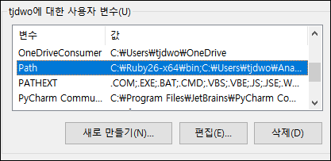
- '새로 만들기' 클릭후 시스템 변수에 추가한 경로 입력 (%JAVA_HOME%\bin)   
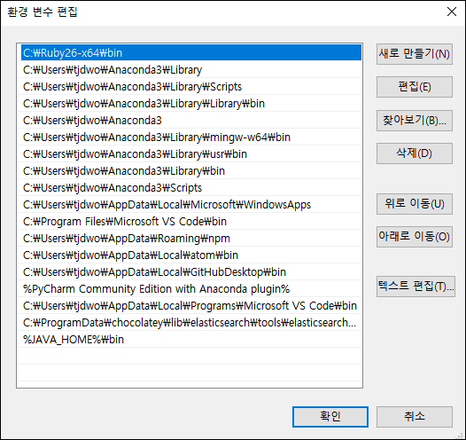
- 모두 완료후 해당 창들 종료

---

## Apache Kafka 설치하기
- 'apache kafka' 검색 후 아래 사이트 접속    
https://kafka.apache.org/    
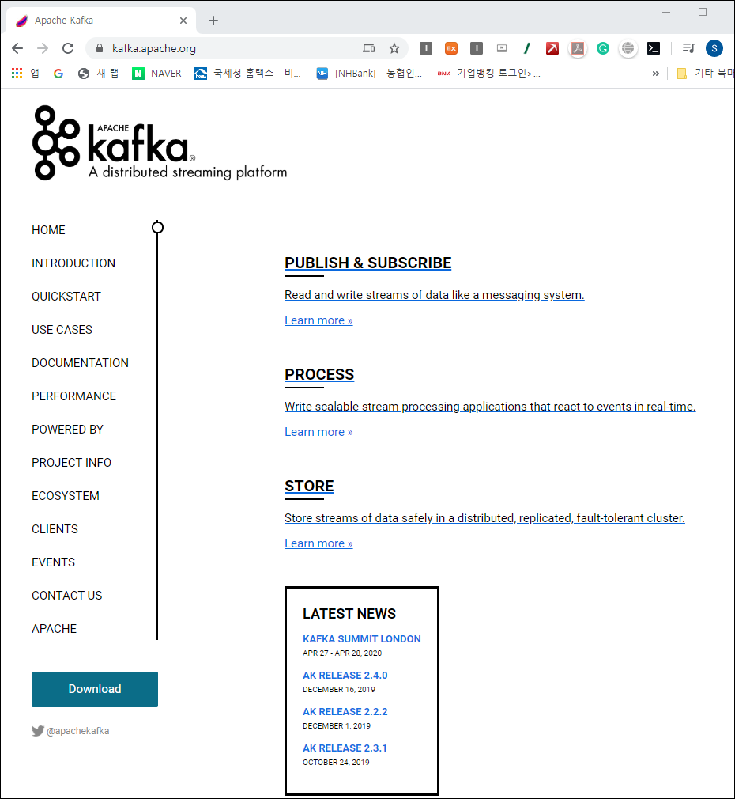

- 왼쪽 탭에 있는 'QUICKSTART' 클릭   
- 퀵스타트의 'Download' 링크 클릭   
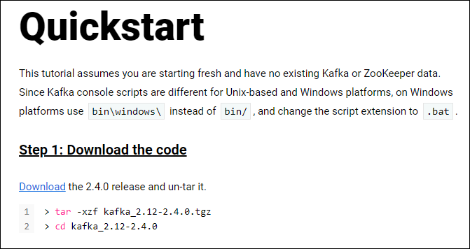
- 아래와 같이 나오는데 저는 아파치에서 추천해주는 아래의 링크를 클릭하여 다운함    
http://mirror.navercorp.com/apache/kafka/2.4.0/kafka_2.12-2.4.0.tgz   
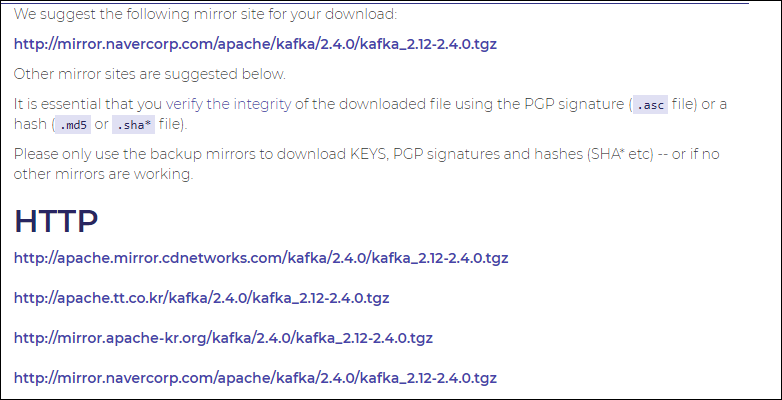   
- 다운받은 파일 압축풀기      
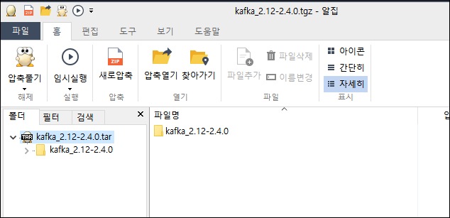   
- 압축해제 완료 후 폴더내부      
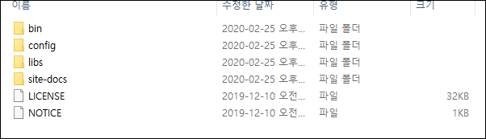   
- 다운로드에 있는 카프카 폴더를 로컬 디스크(C)로 이동 (굳이 안해도 되지만 편의상 이동)   
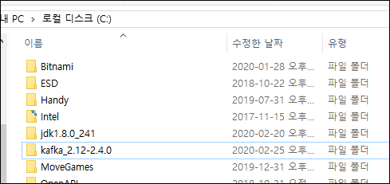
- 경로 이동후 프롬프트 창에서 카프카 실행해보기
  - cd 커맨드를 통해 kafka 폴더에서 -> bin -> windows 폴더 까지 이동   
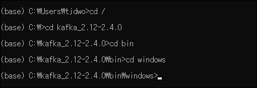
- 경로 이동후 'kafka-topics-bat' 파일 실행해보기
    ```linux
    kafka-topics.bat
    ```
  - 아래와 같은 보안경보가 나올 수 있는데 이떄는 엑세스 허용 해주면 됨      
  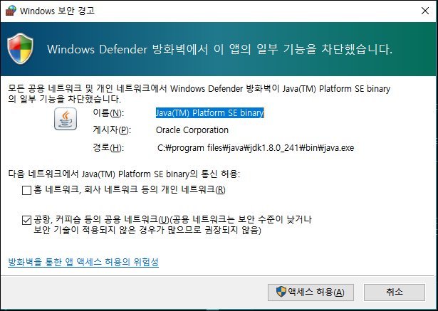   

- 위 명령어 입력시 아래와 같이 출력됨   
  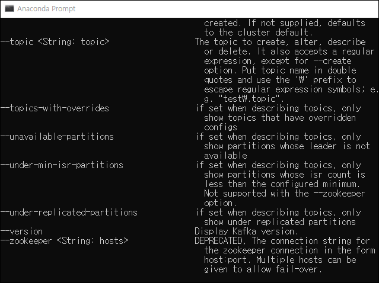
  - 위와 같이 나온다면 Apache Kafka 를 잘 설치한것임
- 하지만 아직 환경변수 설정을 해주지 않아서 다른 경로에서 해당 명령어 실행시 아래와 같이 나옴   
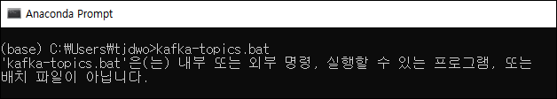    
--> 환경변수에 경로 추가해줘야 함
- kafka/bin/windows 의 경로를 복사 후 환경변수에 추가
  - C:\kafka_2.12-2.4.0\bin\windows
  - 위에서 경로 추가 해줬던것과 같이 진행하면 됨    
  - 시스템 변수말고 사용자 변수에만 추가해주면 됨   
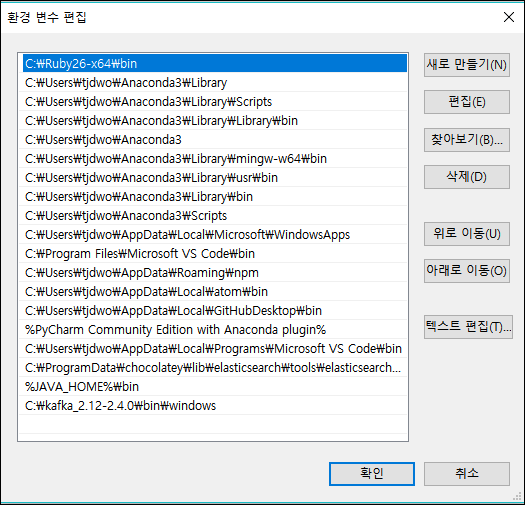
- 경로 추가 후 새로운 프롬프트창에서 다시 아래 명령어 입력하면 결과가 제대로 출력됨   
    ```linux
    kafka-topics.bat
    ```   
    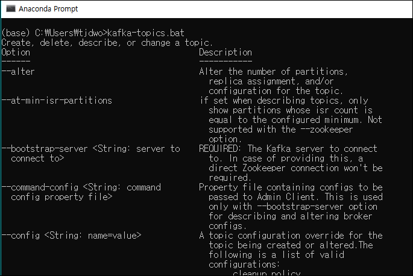
    - 이제 어느 경로에서나 kafka 실행가능!
  

