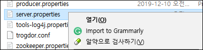
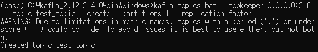

# Building Realtime Maps (2)

## **Create First Kafka Producer and Consumer (feat. CLI)**
- 여기에서 우리는 **Kafka CLI(Command Line Interface)**를 활용해 kafka의 topics, producer, consumer 들을 만들것임
---

## Config 작업 + zookeeper 실행하기
- 저번에 설치한 카프카 폴더에서 'data'라는 새로운 폴더 생성   
- 'data'폴더 내부에 'kafka' 와 'zookeeper' 라는 폴더 생성    

  - log 데이터 저장을 위해 
  - zookeeper는 kafka를 실행하기 위해 필수적인 요소
  
- 다시 돌아가서 kafka 폴더 내부의 'config' 폴더에 들어가기   


- 'config'폴더 안에서 'zookeeper.properties' 파일 열기   
   
   


- 기존의 'dataDir' 부분을 위에서 만들어준 'zookeeper'의 경로로 변경해주기     
   
    - 경로 입력시 '\' 부분을 '/' 로 수정 및 저장하기
    - 수정하지 않으면 경로인식을 못할 수 있음

- 'config'폴더 안에서 'server.properties' 파일 열기   
      
     

- 기존의 'log.dirs' 부분을 똑같이 위에서 만들어준 'data' 폴더의 'kafka' 폴더의 경로로 변경해주기   
   
  - 위에서와 같이 경로 입력시 '\' 부분을 '/' 로 수정 및 저장하기
   
- 'zookeeper.connect' 부분의 정보변경하기    
   
   
    - localhost --> 0.0.0.0 으로 변경      
    (localhost 에서 실행해도 되지만 0.0.0.0으로 변경해서 진행함)(0.0.0.0에 대한 설명 추가)    
       
    - Kafka를 실행하기 위해선 zookeeper가 필요함 

- 설정완료 후 kafka/bin/windows/ 에 있는 'zookeeper-server-start.bat' 파일 실행하기
  - 프롬프트 창을 열어 경로를 windows 폴더로 이동   
  - 아래 명령어 입력
  ```linux
  zookeeper-server-start.bat ../../config/zookeeper.properties
  ```   
          
  - zookeeper server를 시작할때 properties를 추가해줘야함
  - 해당 경로에서 두번 뒤로 간뒤 config 폴더 내부의 'zookeeper.properties'를 같이 실행해줘야함   
- 실행화면   
      
        
  - 0.0.0.0 으로 접속되어 있는것을 확인 가능
  - zookeeper 가 실행중입니다!
---
## Kafka 실행하기
- kafka/bin/windows 경로의 'kafka-server-start.bat' 파일을 실행할 것임
- zookeeper가 실행중인 프롬프트 말고 새로운 프롬프트를 실행시킴
-  아래 커맨드 입력   
    ```linux
    kafka-server-start.bat ../../config/server.properties
    ```
            
    - zookeeper 실행시와 동일하게 config 폴더내의 server.properties' 파일도 같이 실행하기   

- 카프카 실행   
        
  - - 카프카 실행이 완료 되었습니다!   
    - 제일 하단부에 'log4j:ERROR Failed to rename' 이라는 에러가 발생햇는데 이부분은   
      추후에 문제 발생하면 해결해보도록 하겠습니다.
    - 아래와 같이 data/kafka 폴더내부에 log 와 checkpoint 들이 생겨남을 확인가능      
        
---
## Kafka Topic 만들기
    - 위에서 zookeeper와 kafka를 실행했습니다
    - 새로운 프롬프트에서 kafka topic을 생성해보겠습니다
- 경로를 kafka/bin/windows로 이동후 아래 명령어 실행
  ```linux
  kafka-topics.bat --zookeeper 0.0.0.0:2181 --topic test_topic --create --partitions 1 --replication-factor 1
  ```
  - 'kafka-topics.bat' 파일을 실행하며 현재 실행중인 zookeeper server에 topic을 만들어 줄것임
  - topic의 이름은 --topic 뒤에 임의의 이름인 'test_topic' 을 입력
  - 그리고 topic 안에 들어갈 파티션도 같이 생성 (이 부분은 나중에 추가설명)   
  
- 명령어 실행 후 topic 생성된것 확인하기    
    
  - 'test_topic'이란 이름의 topic 이 broker에 생성완료!
- 아래의 명령어로 방금 생성한 topic에 관한 좀더 상세한 설명을 확인가능   
  ```linux
  kafka-topics.bat --zookeeper 0.0.0.0:2181 --topic test_topic --describe
  ```
    
---
## Kafka Producer & Consumer
    - Kafka Producer를 통해 위에서 만들어논 topic-test(broker)에 message를 보내볼것임
- 아래의 명령어를 입력
  ```linux
  kafka-console-producer.bat --broker-list localhost:9092 --topic test_topic
  ```
- 그리고 아래와 같이 message1/message2/message3를 각 줄에 입력하기 (메세지3개를 생산)    
 

---

    - 새로운 프롬프트에서 Consumer 를 실행하여 방금 Producer에서 생성하고 test-topic에 저장된 메세지 확인하기      
- 아래의 명령어를 입력   
  ```linux
  kafka-console-consumer.bat --bootstrap-server localhost:9092 --topic test-topic --from-beginning
  ```
   
  - 하하...위의 사진과 같이 정말 많은 message들이 있는 이유는...
  - 일단 처음 producer에서 메세지를 보내고 (이때까진 순탄했음) consumer에서 message를 확인하려 하는데....
  - 이상하게 message를 consume하지 못하는것임. 그래서 전송이 늦는건가 하고 계속 기다려도 보고 다시 producer에서 메세지 보내보기도 하고 했는데도...
  - 메세지는 오질 않아서 zookeeper 서버/kafka 서버/ producer/ consumer 등등 다 껏다가 다시 했는데도 안되길래
  - 이건 문제가 있다 싶어서 구글링 시작함
  - 한 30분 정도 찾다가 발견한것이 아래 링크
  - https://stackoverflow.com/questions/35217603/kafka-python-consumer-not-receiving-messages
  - 위 링크 내용 중에서도 group-id 변경에 관해서 보고 kafka/config 안에서 'consumer.properties' 를 찾아봄   
     
  - 사진에 보면 group-id:None 이라고 되어 있는데 기존에는 'test-consumer-group'이라고 되어 있었음
  - 이것을 바꿔서 해결됫다! 라고 확신은 못하지만 일단 **group-id**를 **None**으로 변경 후 다시 서버들 재시작하고 producer를 킨 후 메세지를 보내니 consumer에서 응답 받음!!!!
  - [참고] 나중에 python 에서 producer/consumer를 만들때 옵션중 'auto_offset_reset' 이란게 있는데 이부분 작성시 'earliest' 옵션을 넣었을때 같은문제 해결에 도움된다는 얘기도 있었음
    - auto_offset_reset='earliest'
  - 별다른 오류메세지 없이.. 심지어 log도 있는데 단순히 consumer에서 메세지를 못 받은 거라 host가 잘못된건지 뭐가 잘못된건지 이것저것 찾다가 겨우 해결함
  - 다.행.이.다.

- Producer에 message를 작성하면 Consumer에서 바로 확인가능   
 

- 드디어 CLI를 활용하여 첫 Kafka producer/consumer를 만들었습니다.
