# Building Realtime Maps (3)

## Create First Kafka Producer in Python with Pykafka library
- 아래의 그림과 같은 구조를 형성할것임   
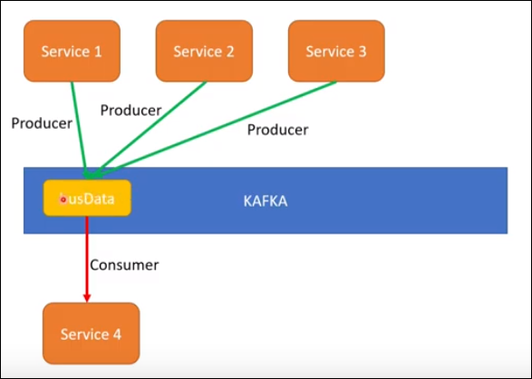

---

## Start both Zookeeper and Kafka
- 일단 저번에 했던것과 동일하게 zookeeper와 kafka를 실행시켜야함
### Zookeeper 실행
- 설정완료 후 kafka/bin/windows/ 에 있는 'zookeeper-server-start.bat' 파일 실행하기
  - 프롬프트 창을 열어 경로를 windows 폴더로 이동   
  - 아래 명령어 입력
  ```linux
  zookeeper-server-start.bat ../../config/zookeeper.properties
  ```
---
### Kafka 실행
- kafka/bin/windows 경로의 'kafka-server-start.bat' 파일을 실행할 것임
- zookeeper가 실행중인 프롬프트 말고 새로운 프롬프트를 실행시킴
-  아래 커맨드 입력   
    ```linux
    kafka-server-start.bat ../../config/server.properties
    ```
    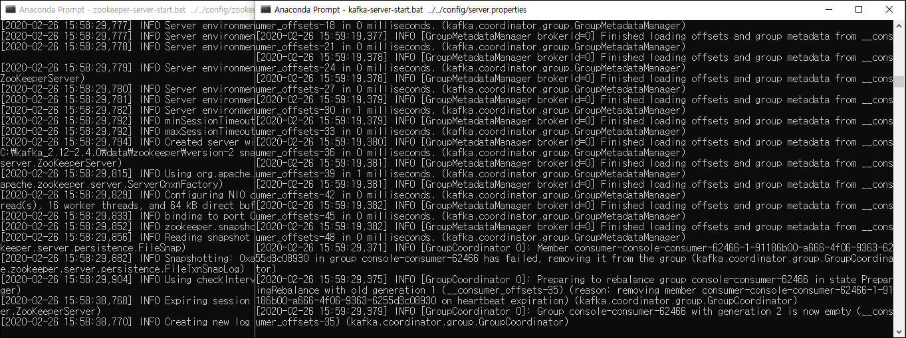      
    - 둘 다 실행완료

---
## 새로운 토픽 생성하기

- 아래 명령어 입력   
    ```linux
    kafka-topics.bat --zookeeper localhost:2181 --topic testBusdata --create --partitions 1 --replication-factor 1
    ---
- localhost:2181 port에 접속하고, 'testBusdata' 라는 topic을 생성   
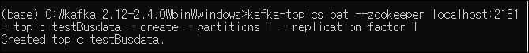

---

## Pykafka library 설치 및 기본구조 설정하기
    -   Python 과 Kafka를 같이 쓰기위한 패키지인 Pykafka를 설치하고 사용 할 것임

### busdata.py 파일 생성
- 일단 busdata.py 라는 이름의 파이썬 파일을 하나 만들어 둠
- 현재 사용중인 **Visual Studio Code**로 해당 폴더에 생성   


### Pykafka library 검색 및 설치
- 구글에 pykafka 검색 또는 해당 링크 접속   
https://pykafka.readthedocs.io/en/latest/   
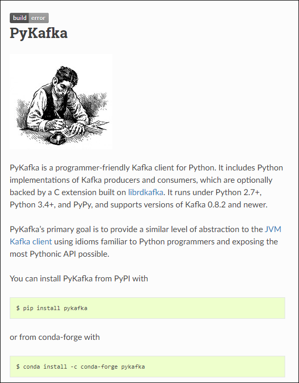

- 새 프롬프트창에서 'pip install pykafka' 를 입력하여 설치      
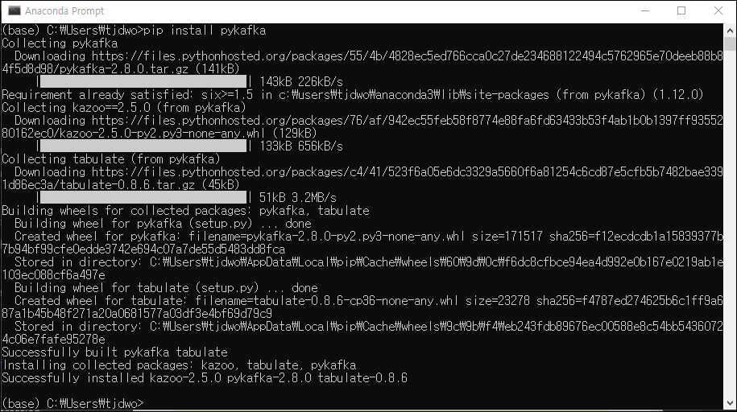
- 설치 완료

### Importing Kafka client form Pykafka
- 만들어둔 busdata.py 파일에 아래 코드들 작성   
    ```python
    from pykafka import KafkaClient
    client = KafkaClient(hosts="localhost:9092")
    ```   
    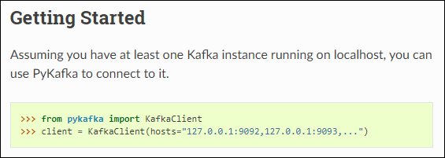
- KafkaClient 를 임포트하고 호출
- Kafka broker가 실행중인 나의 clients 설정 (localhost)
- localhost에 최소 하나 이상의 kafka instance가 작동하고 있어야 함

### localhost 내의 topic 확인
- 아래 코드 입력하여 결과 확인
    ```python
    from pykafka import KafkaClient
    client = KafkaClient(hosts="localhost:9092")

    print(client)
    print(client.topics)
    ```
    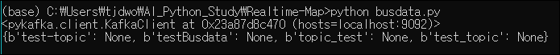
    - localhost에 있는 모든 topic 확인가능
  
- 아래 코드 추가
  ```python
  print(client.topics['testBusdata'])
  ```
    

    - testBusdata topic에 접근

---

## Producer 생성, 메세지 보내기 + Consumer 확인하기
- 파이썬으로 producer 생성, 메세지 보내기를 한 뒤 consumer에서 받은 메세지 확인할 것임   
  ```python
  # producer 생성
  producer = topic.get_sync_produer()
  # message 보내기
  producer.produce('test message')
  ```   
- 아래 명령어로 topic이 'testBusdata;인 consumer에 접속후 메세지 확인
    ```linux
    kafka-console-consumer --bootstrap-server localhost:9092 --topic testBusdata --from-beginning
    ```
- Consumer 실행 뒤 'busdata.py'를 실행 시키면!! .... 아래와 같은 에러메세지가 나옵니다   
    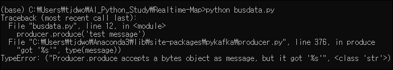
    - Producer.produce 는 bytes object를 메세지로서 받는데 우리가 보낸것은 str 클래스의 문자라서 그런것임!   
  ---> encoding 필요, 아래와 같이 수정
    ```python
    producer.produce('test message'.encode('utf8')) # utf8 말고 ascii 등 다른것도 사용가능
    ```
    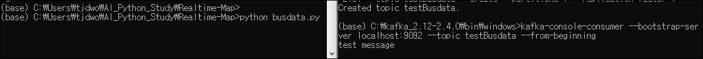
    - 메세지 전송 및 수신 완료!
    - 코드   
    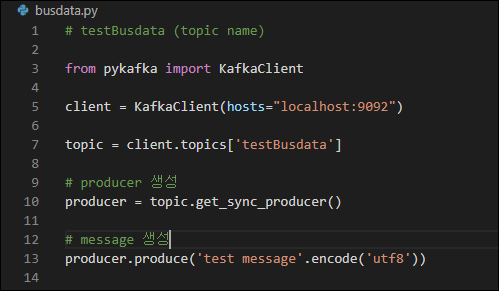

### [번외] while을 사용하여 메세지 무한히 생성
- 아래 코드를 넣고 실행시켜서 producer가 계속 메세지 보내고 consumer가 계속 메세지 받는 모습 확인해보기
```python
# message 생성
count = 1
while true:
    message = ('hello-' + str(count)).encode('utf8')
    producer.produce(message)
    print(message)
    count += 1
```   
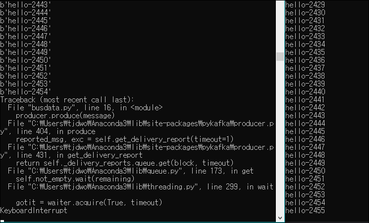
- 10초도 안되는 사이에 2000이 넘는 메세지가 생성/전송/확인 됨
---

## Geojason 에서 Busline Coordinate 받아오기
    -   Producer 에서 Consumer에 보내줄 메세지 정보(Busline Coordinate)를 가져오기 위해 geojason 이라는 웹페이지를 이용할것임   
  
### Geojason 접속, 좌표 획득
- 아래 페이지 접속   
http://geojson.io/#map=2/20.0/0.0   
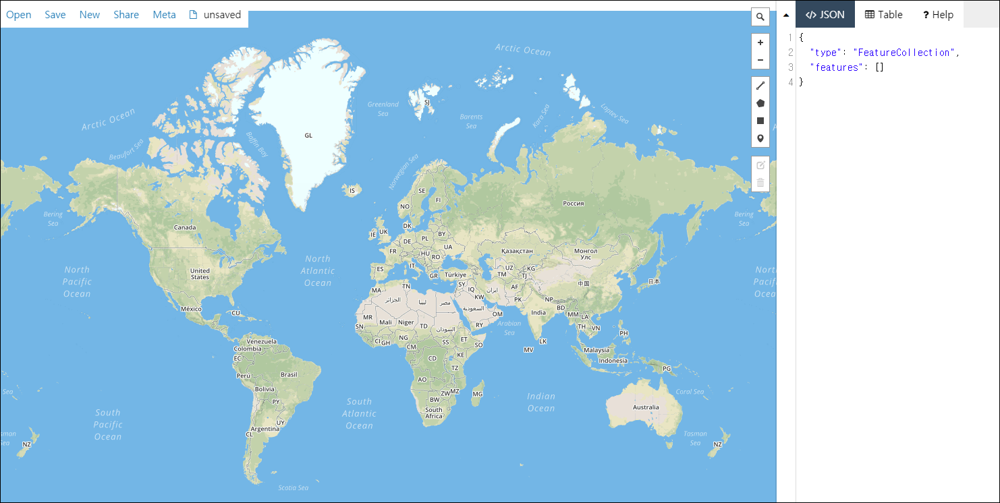   
- 본인이 기져올 지역의 coordinate(좌표) 설정    
  - 아래 그림의 오른쪽 상단의 툴바에서 표시된 도구를 사용하여 본인이 가져올 구간의 좌표 지정
   
  - 임의로 일정 구간 지정함
  - 추후에 실제 버스노선에 맞는 구간 지정 후 json 형태로 가져오면됨   
  - 아래와 같이 json 형태로 된 정보를 가져올 수 있음   
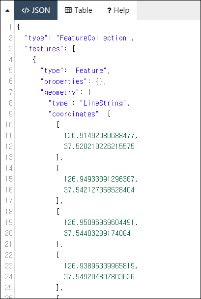    

### 'data' 폴더에 좌표가 기록된 json 파일 생성
- 'data'라는 새로운 폴더를 만들고 그 안에 위에서 가져온 정보를 담은 json 파일 생성하기
    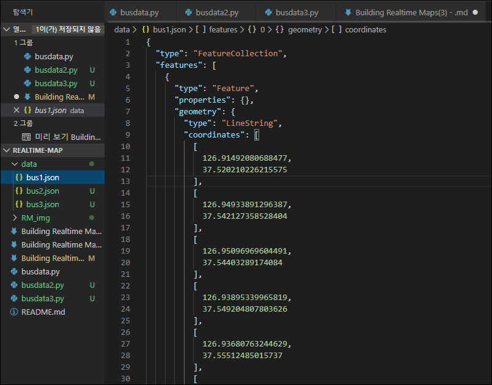    
    - 'busdata2', 'busdata3' 에는 각기 다른 버스라인의 좌표데이터 넣어주기   
---

## Producer에서 Consumer로 message 보내는 코드 작성하기
    - 위에서 작성했던 코드를 기반으로, 우리가 저장한 json 파일의 내용에서 필요한 coordinate 값만 추출하여 message 변수로 만들어 consumer로 전송시킬것임
- 작성완료된 코드 ('busdata.py' 로 저장되어있음)
```python
from pykafka import KafkaClient
import json
from datetime import datetime
import uuid


client = KafkaClient(hosts="localhost:9092")

topic = client.topics['testBusdata']

# producer 생성
producer = topic.get_sync_producer()


# read Coordinates from geojason
input_file = open('./data/bus1.json')
json_array = json.load(input_file) # json 형식의 데이터 로드

# 가져온 json format data에서 coordinates 부분만 뽑기
coordinates = json_array['features'][0]['geometry']['coordinates'] 

# generate uuid
def generate_uuid():
    return uuid.uuid4()

data = {}
data['busline'] = '00001'

#construct message and send it to kafka
def generate_checkpoint(coordinates):
    i = 0
    while i < len(coordinates):
        data['key'] = data['busline'] + '_' + str(generate_uuid())
        data['timestamp'] = str(datetime.now())
        data['latitude'] = coordinates[i][1]
        data['longitude'] = coordinates[i][0]
        message = json.dumps(data)
        print(message)
        producer.produce(message.encode('utf8'))
        i += 1

generate_checkpoint(coordinates)
```
  - 'busdata.py' 파일을 실행 했을때의 모습   
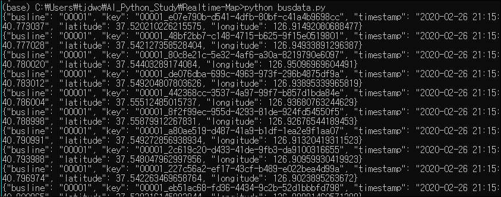    
  - Consumer에 message 가 전송되어 쌓인 모습 (윗부분에 이전 메세지인 hello~ 가 보임)
    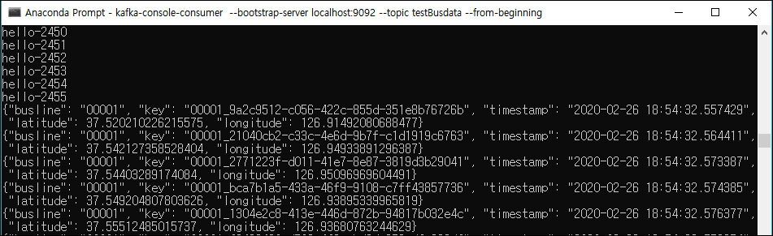   


