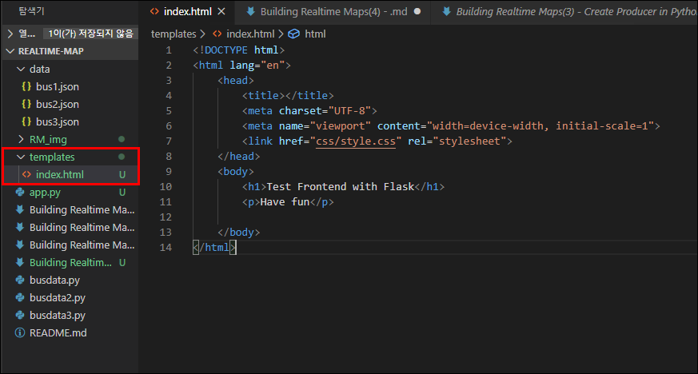

# Building Realtime Maps (4)

## (web)Create Kafka Consumer with Python, Flask

## What & Why Flask?
```
- A Python Microframework
- Web development, One drop at a time
- Fun
- Easy to setup
```

## Flask 설치, 기본설정 및 실행하기
### Flask 설치
- [Flask](https://flask.palletsprojects.com/en/1.1.x/installation/#python-version) 홈페이지 참고 또는
- 프롬프트 창에서 'pip install' 을 사용하여 간편설치 가능   
    ```linux
    pip install Flask
    ```
    
    - 이미 설치되어 있어 위와 같은 메세지 출력됨

### 기본설정
- 같은 디렉토리에 'app.py' 라는 이름의 앱 만들기
- 테스트를 위한 간단한 코드 작성
    ```python
    from flask import Flask

    # 앱 생성
    app = Flask(__name__)

    # 라우트 생성
    @app.route('/')
    def index():
        # 랜덤 텍스트 리턴
        return('Flask Test')

    # 앱 실행시키기
    if __name__ == '__main__':
        # debug=True 라고 해놓으면 후에 리턴하는 텍스트 값을 수정시 바로 적용이 됨
        app.run(debug=True, port= 5001)
    ```
    

### 앱 실행
- 프롬프트 창에서 'app.py' 실행   
    
    - 앱이 실행됨
    - 127.0.0.1 ==> localhost   
- 브라우저에서 접속/확인 가능   


### render_template 임포트
- html 파일들을 별도로 관리할 계획인데 이것을 불러오기 위해 사용
    ```python
    from flask import Flask, render_template

    # 앱 생성
    app = Flask(__name__)

    # 라우트 생성 (현재 '/'로 되어 있는 부분은 수정가능)
    @app.route('/')
    def index():
        # 'index.html' 불러올기
        return(render_template('index.html'))

    # 앱 실행시키기
    if __name__ == '__main__':
        # debug=True 라고 해놓으면 후에 리턴하는 텍스트 값을 수정시 바로 적용이 됨
        app.run(debug=True, port= 5001)
    ```
       
    
    - 같은 디렉토리에 'templates'폴더 생성 후 'index.html' 추가하기
    - 적용완료!
---

## Pykafka를 사용하여 Flask와 Consumer 연동하기
### 필요 패키지 import 및 기본설정 (설명추가)
```python
from flask import Flask, render_template, Response
from pykafka import KafkaClient

# local kafka broker 불러오기
def get_kafka_client():
    return KafkaClient(hosts='127.0.0.1:9092')

# 앱 생성
app = Flask(__name__)

# 메인 라우트 생성
@app.route('/')
def index():
    # 랜덤 텍스트 리턴
    return(render_template('index.html'))

# Consumer API (컨슈머 불러오는 별도의 라우트)
@app.route('/topic/<topicname>')
def get_messages(topicname):
    client = get_kafka_client()
    # consume messages from topics = Consumer
    def events:
        # kafka broker에서 topicname으로 접근
        # Topic에 계속 접근하여 message 받아옴
        for i in client.topics[topicname].get_simple_consumer():
            # generator를 사용하여 메세지가 새로 들어올때마다 출력하도록
            # 메세지는 바이트로 들어오기때문에 decode 필요
            yield 'data:{0}\n\n'.format(i.value.decode())
    # events 함수를 Response로 호출
    # event-stream 으로 결과를 받고 브라우저에 계속 리턴해줌 
    return Response(events(), mimetype='text/event-stream')
# 앱 실행시키기
if __name__ == '__main__':
    # debug=True 라고 해놓으면 후에 리턴하는 텍스트 값을 수정시 바로 적용이 됨
    app.run(debug=True, port= 5001)
```
### 새로운 토픽 만들기
- 위 코드의 'topicname'에 들어갈, frontend 테스트용 토픽 생성
    ```linux
    kafka-topics.bat --zookeeper localhost:2181 --topic testFrontend --create --partitions 1 --replication-factor 1
    ```
    - 해당 명령어 입력하여 'testFrontend' 라는 이름의 토픽 생성
    - [참고] 이때 기본적으로 zookeeper와 kafka는 실행중이어야 함! 왜 자꾸 토픽이 안만들어지지? 하고 있는데 보니까 주키퍼랑 카프카가 실행중이지 않음...

- 주키퍼와 카프카가 실행중이지 않을때 토픽을 생성하려니 뜬 메세지 + 실행 시킨 후 토픽 제대로 생성    


### Produce Data: message 보내고 잘 받아지는지 확인
- 아래 명령어를 입력하여 producer 실행
    ```linux
    kafka-console-producer.bat --broker-list localhost:9092 --topic testFrontend
    ``` 
- producer에서 메세지 입력하고 브라우저에 자동 업데이트 되는지 확인   

    
    - 확인완료!!