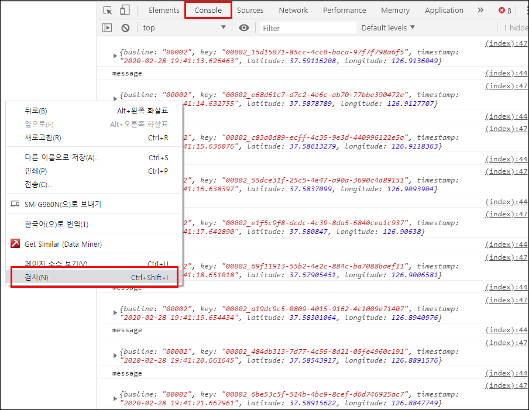

# Building Realtime Maps (5)

## Create a Leaflet Live Map
> 이번 시리즈의 마지막 과정으로, 지도정보를 제공해주는 
> 오픈소스 자바스크립트 라이브러리, Leaflet, 을 이용하여 제가 서울에서 자주 이용했던 버스들의 정류장 좌표를 가지고 Interactive 한 Live Map을 만들어 보겠습니다
> > 여기에선 Leaflet 이라는 open source를 사용했는데, 지도정보를 제공하는 다른 오픈소스/API를 사용하여도 무관 ex) 카카오map, 네이버map 등등

---
## Web에 Live Map을 띄위기 위한 기본작업
### Leaflet 에서 제공하는 Javascript 가져오기
- [Leaflet](https://leafletjs.com/) 홈페이지 접속    

    
- Leaflet Tutorials 안의 'Leaflet Quick Start Guide' 클릭      

    
- 해당 부분 코드 'index.html'에 삽입   

    
- 'index.html' 수정본   

    
    - 복사한 코드는 head 태그 안에 넣어주기
    - div 부분에 style을 추가해줬는데, css파일을 별도로 만들어도 무관
    - title 과 head는 'Seoul Bus Live Map'으로 수정

- 페이지 아래부분에 있는 Map Object 삽입파트   
    
    - 표시한 부분의 코드를 body 태그 안에 넣어줌

- 'index.html' 수정본 (2)   
    
    - 위의 'var mymap' 부분의 'setView' 에 기존에는 London 시내 한곳의 좌표가 있는데 이부분을 서울의 아무 좌표로 바꿔줌
    - 그 뒤의 13은 어느정도로 zoom을 할 것인지 설정
    - 밑의 accessToken은 본인이 받은 'mapbox'의 토큰을 삽입
---

### 'MapBox' 에서 accessToken 받기
- [MapBox](https://www.mapbox.com/) 들어가기   
  
    

- 계정 생성   
 
    

- Access Token 생성 및 복사 후 붙여넣기   

    
    
    - 기본적인 작업은 끝!
  
- 작업이 잘 이뤄졌는지 확인하기

    
    
    - flask를 실행하고 Web 을 띄웁니다
    - 127.0.0.1:5001 로 접속해보면 서울지도를 확인가능합니다!
    - Seoul 이라는 이름 정 가운데에 마커가 똭! (마커는 임의로 추가함)


---
## Map에 3개의 버스라인 Live 마커 넣기
> 기존에 사용했던 좌표 외에 제가 학교를 다니면서 자주 이용했던 버스들의 정류장 좌표를 가지고와 각각 마커로 표시해보려고 합니다

### 버스노선별 정류장 좌표가져오기
> '버스 노선별 정류장 좌표'를 얻어야 하는데, 처음엔 [공공데이터포털](https://www.data.go.kr/)에서 관련 API를 활용해 가져오려 했지만 API에서 제공해주는 데이터가 달라졌는지 제가 딱 원하는 데이터가 없어서 다른 방법을 찾아보던 와중 [SeoulTopis](https://topis.seoul.go.kr/)에서 제가 원하던 데이터를 얻을 수 있었습니다. 그 방법을 간략하게나마 정리해봅니다
- [SeoulTopis](https://topis.seoul.go.kr/) 접속   

    
    - 생각보다 많은 정보를 제공해줌 (기본적으로 공공데이터포털에서 API 등을 제공받아 만들어짐)
    - 왼쪽 툴바에서 버스를 클릭하여 본인이 찾는 버스번호 검색

- 버스노선 검색 후 정류소 별 좌표 파일 얻기   

    
    
    - 본인이 찾은 버스번호를 클릭하면 해당 버스의 노선이 지도에 표기됨
    - '실시간 버스위치 보기'를 클릭하면 실제 운행중인 버스들의 위치 확인가능
    - 하단의 정류소현황 버튼을 클릭하면 'stationlist.xlsx'라는 엑셀파일 다운 가능
    - 각 정류소의 순번, 정류소명, 좌표 등이 기록되어있음

### 버스 정류장의 각 좌표 정보만 json 형태로 변환하기
> 다운받은 엑셀 데이터를 json 파일 또는 json 형태로 변환해줘야 함 (다른 방법도 있겠지만 여기선 기존에 만들어둔 틀을 이용하기 위해 이렇게 진행함)
- 'excel_to_json.py'라는 파이썬 파일을 하나 만듦
- 아래 코드 입력 후 파일 실행
```python
import json
import xlrd
from collections import OrderedDict

wb = xlrd.open_workbook('7612.xlsx')
sh = wb.sheet_by_index(0)

data_list = []

for rownum in range(1, sh.nrows):
    data = OrderedDict()
    row_values = sh.row_values(rownum)
    # 좌표값만 가져와 저장
    data['x_coordi'] = row_values[3]
    data['y_coordi'] = row_values[4]
    # data_list에 좌표값 추가
    data_list.append(data)

# ensure_ascii=False 옵션넣어주면 한글깨짐/바이트출력 문제 해결됨
# json 형태의 문자열을 보기 좋게 나오게 하려면 dumps에 indent 옵션 추가
j = json.dumps(data_list, ensure_ascii=False, indent=4)

# json파일로 저장
with open('7612.json', 'w+') as f:
    f.write(j)
```
- 결과물   


- 아래와 같이 좌표값만 버스 정류장들의 좌표로 수정   
    
    > 위 작업을 다른 버스노선 것도 동일하게 수행 (이것 또한 좌표값만 가지고 해도 상관은 없으나 기존 내용의 틀을 일단은 최대한 유지한상태로 진행했음)

---

### 3개의 Live 마커를 넣어주기 위한 작업
> 위에서 저장한 3가지의 정류장 좌표들을 지도에 마커로 보여주기 위한 코드 작업 진행
- 'index.html'의 access token 정보 넣어준 script 아래에 추가적으로 아래 코드 입력(javascript)
  
```javascript
 <script>
            var mymap = L.map('mapid').setView([37.5473, 126.9085], 12);
            var marker = L.marker([37.5473, 126.9085]).addTo(mymap);
            L.tileLayer('https://api.mapbox.com/styles/v1/{id}/tiles/{z}/{x}/{y}?access_token={accessToken}', {
                attribution: 'Map data &copy; <a href="https://www.openstreetmap.org/">OpenStreetMap</a> contributors, <a href="https://creativecommons.org/licenses/by-sa/2.0/">CC-BY-SA</a>, Imagery © <a href="https://www.mapbox.com/">Mapbox</a>',
                maxZoom: 18,
                id: 'mapbox/streets-v11',
                tileSize: 512,
                zoomOffset: -1,
                accessToken: 'your token number'
            }).addTo(mymap);
            
            // 버스 (7612,7611,6714) 마커생성
            mapMarkers1 = [];
            mapMarkers2 = [];
            mapMarkers3 = [];
            
            // 새로운 event source 생성, busdata_seoul 이라는 topic 사용
            var source = new EventSource('/topic/busdata_seoul');
            // 새로운 메세지가 생성 될때마다 업데이트 해주기 위한 event listener 추가
            source.addEventListener('message', function(e){

                // console에 메세지가 어떻게 전달되는지 보기위해 log 추가
                console.log('message');
                // 받은 log 데이터 json 형태로 파싱 후 log 기록
                obj = JSON.parse(e.data);
                console.log(obj);
                
                // 전달받은 message가 7612 버스의 좌표 데이터 라면
                if(obj.busline == '00001'){
                    for (var i = 0; i < mapMarkers1.length; i++){
                        // 가장 최신에 기록된 마커만 남겨두기위해 이전것은 제거
                        mymap.removeLayer(mapMarkers1[i]);
                    }
                    // 새로운 마커 생성, marker1에 7612의 각 정류소별 좌표 입력하여 맵에 표시
                    marker1 = L.marker([obj.latitude, obj.longitude]).addTo(mymap);
                    mapMarkers1.push(marker1);
                }

                // 7611 버스라면
                if(obj.busline == '00002'){
                    for (var i = 0; i < mapMarkers2.length; i++){
                        mymap.removeLayer(mapMarkers2[i]);
                    }
                    marker2 = L.marker([obj.latitude, obj.longitude]).addTo(mymap);
                    mapMarkers2.push(marker2);
                }

                // 6714 버스라면
                if(obj.busline == '00003'){
                    for (var i = 0; i < mapMarkers3.length; i++){
                        mymap.removeLayer(mapMarkers3[i]);
                    }
                    marker3 = L.marker([obj.latitude, obj.longitude]).addTo(mymap);
                    mapMarkers3.push(marker3);
                }
            },  false);
        </script>
```
### 새로운 topic 생성 'busdata_seoul'
- 새 프롬프트 창에서 아래 명령어 입력
    ```linux
    kafka-topics.bat --zookeeper localhost:2181 --topic busdata_seoul --create --partitions 1 --replication-factor 1
    ```
       
- 기존 'busdata1.py', 'busdata2.py', 'busdata3.py' 에 입력된 topic 말고, 위에서 만든 topic 이름으로 변경 해줘야 함   

    

---

### Map에서 마커들의 변화 확인하기
> 각 busdata.py 파일들을 실행시키고, producer가 생산해내는 message가 전달되는 모습을 web 상에서 확인해보기
- 각기 다른 프롬프트에서 'busdata1.py', 'busdata2.py', 'busdata3.py' 파일들 실행   
 

- 웹페이지에서 우클릭 --> '검사' 클릭 --> 'Console' 클릭 하여 메세지 로그 확인
    
    
    - 메세지가 기록되는것 확인 + 맵상에서 3개의 마커들의 위치가 지속적으로 변하는것 확인
    - = 완.료.!


